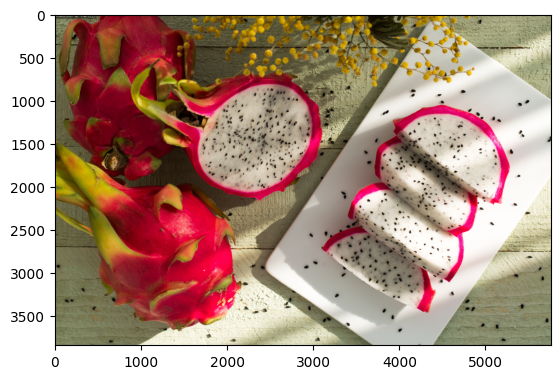

# MMPretrain Train

```
06/09 06:37:32 - mmengine - INFO - Exp name: mmpretrain_fruits_20230609_063602
06/09 06:37:32 - mmengine - INFO - Saving checkpoint at 10 epochs
06/09 06:37:35 - mmengine - INFO - Epoch(val) [10][14/14]    accuracy/top1: 84.7059  data_time: 0.0178  time: 0.0370
```

# MMPretrain Test

```
06/09 06:39:03 - mmengine - WARNING - The prefix is not set in metric class DumpResults.
Loads checkpoint by local backend from path: work_dirs/mmpretrain_fruits/epoch_10.pth
06/09 06:39:04 - mmengine - INFO - Load checkpoint from work_dirs/mmpretrain_fruits/epoch_10.pth
06/09 06:39:05 - mmengine - INFO - Results has been saved to outputs/fruits_test_results.pkl.
06/09 06:39:05 - mmengine - INFO - Epoch(test) [15/15]    accuracy/top1: 84.8812  data_time: 0.0368  time: 0.0663
Testing finished successfully.
```


# MMPretrain Inference



```
[{'pred_scores': array([1.4518866e-15, 8.4906309e-12, 2.3767050e-15, 5.4234547e-11,
         1.3858916e-11, 2.1236439e-12, 1.0594457e-17, 1.9640231e-12,
         7.8983566e-14, 1.3888977e-11, 1.0000000e+00, 1.6063756e-14,
         3.1127653e-11, 4.5606257e-15, 9.3772143e-12, 5.2479695e-14,
         2.1433373e-10, 3.9942155e-12, 7.4352368e-13, 2.1253507e-15,
         8.8249791e-10, 8.8602151e-13, 6.6233659e-12, 9.6424455e-14,
         8.5500197e-14, 6.3125095e-11, 5.8663877e-12, 5.2888699e-13,
         1.4362792e-09, 4.3990672e-10], dtype=float32),
  'pred_label': 10,
  'pred_score': 1.0,
  'pred_class': '火龙果'}]
```


# Code

[Jupyter Notebook](./notebooks/homework2_mmpretrain.ipynb)