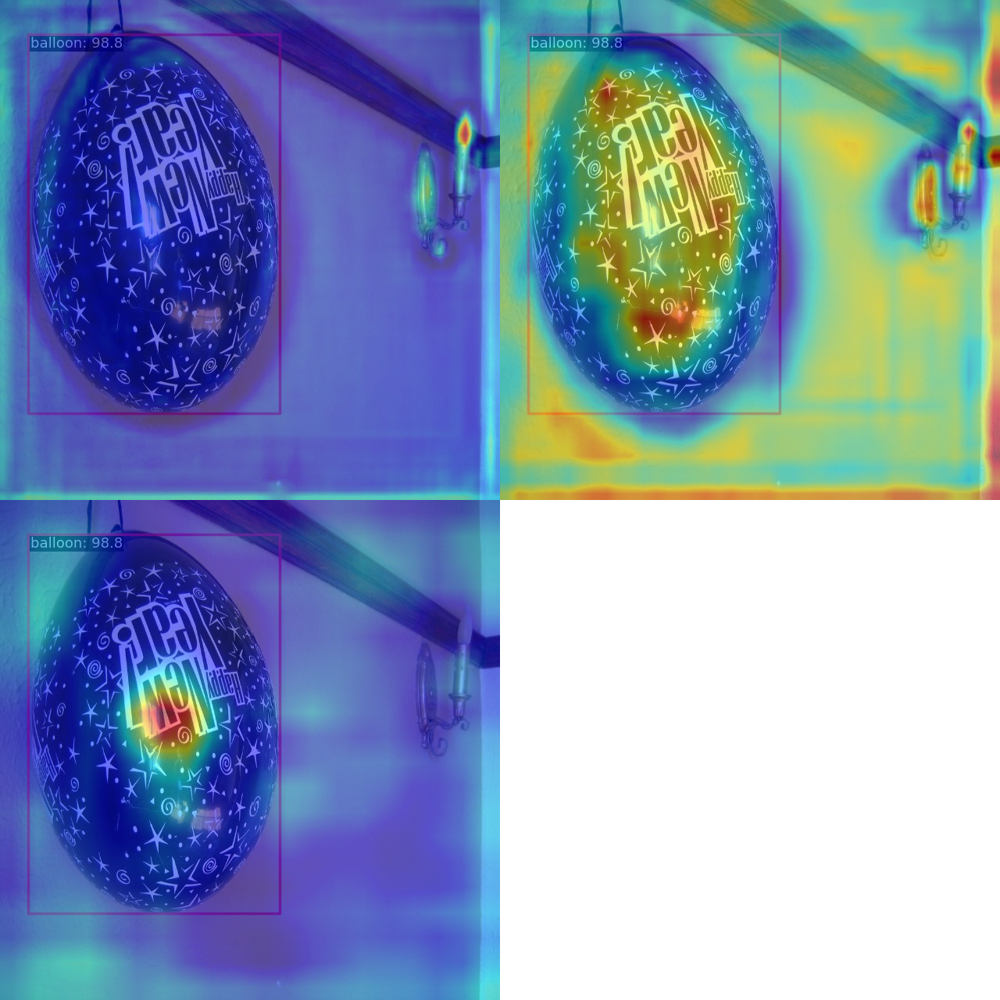
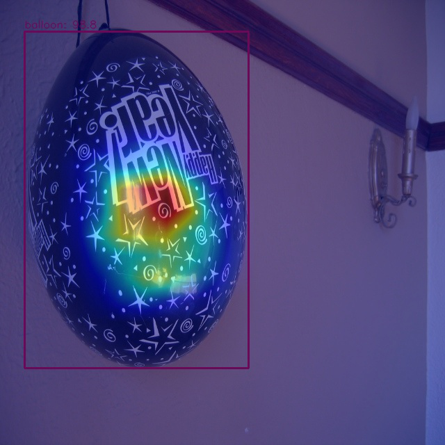

# Balloon

## MMDetection Train

```
06/10 20:03:05 - mmengine - INFO - Exp name: rtmdet_tiny_1xb12-40e_balloon_20230610_195844
06/10 20:03:08 - mmengine - INFO - Epoch(train) [40][5/6]  lr: 9.4971e-06  eta: 0:00:00  time: 0.8506  data_time: 0.5101  memory: 1623  loss: 0.7006  loss_cls: 0.4912  loss_bbox: 0.2094
06/10 20:03:08 - mmengine - INFO - Exp name: rtmdet_tiny_1xb12-40e_balloon_20230610_195844
06/10 20:03:08 - mmengine - INFO - Saving checkpoint at 40 epochs
06/10 20:03:10 - mmengine - INFO - Epoch(val) [40][ 5/13]    eta: 0:00:00  time: 0.0632  data_time: 0.0231  memory: 307  
06/10 20:03:10 - mmengine - INFO - Epoch(val) [40][10/13]    eta: 0:00:00  time: 0.0595  data_time: 0.0212  memory: 213  
06/10 20:03:10 - mmengine - INFO - Evaluating bbox...
Loading and preparing results...
DONE (t=0.00s)
creating index...
index created!
Running per image evaluation...
Evaluate annotation type *bbox*
DONE (t=0.11s).
Accumulating evaluation results...
DONE (t=0.01s).
 Average Precision  (AP) @[ IoU=0.50:0.95 | area=   all | maxDets=100 ] = 0.706
 Average Precision  (AP) @[ IoU=0.50      | area=   all | maxDets=100 ] = 0.820
 Average Precision  (AP) @[ IoU=0.75      | area=   all | maxDets=100 ] = 0.783
 Average Precision  (AP) @[ IoU=0.50:0.95 | area= small | maxDets=100 ] = 0.021
 Average Precision  (AP) @[ IoU=0.50:0.95 | area=medium | maxDets=100 ] = 0.535
 Average Precision  (AP) @[ IoU=0.50:0.95 | area= large | maxDets=100 ] = 0.855
 Average Recall     (AR) @[ IoU=0.50:0.95 | area=   all | maxDets=  1 ] = 0.222
 Average Recall     (AR) @[ IoU=0.50:0.95 | area=   all | maxDets= 10 ] = 0.754
 Average Recall     (AR) @[ IoU=0.50:0.95 | area=   all | maxDets=100 ] = 0.790
 Average Recall     (AR) @[ IoU=0.50:0.95 | area= small | maxDets=100 ] = 0.167
 Average Recall     (AR) @[ IoU=0.50:0.95 | area=medium | maxDets=100 ] = 0.706
 Average Recall     (AR) @[ IoU=0.50:0.95 | area= large | maxDets=100 ] = 0.900
06/10 20:03:10 - mmengine - INFO - bbox_mAP_copypaste: 0.706 0.820 0.783 0.021 0.535 0.855
06/10 20:03:10 - mmengine - INFO - Epoch(val) [40][13/13]  coco/bbox_mAP: 0.7060  coco/bbox_mAP_50: 0.8200  coco/bbox_mAP_75: 0.7830  coco/bbox_mAP_s: 0.0210  coco/bbox_mAP_m: 0.5350  coco/bbox_mAP_l: 0.8550  data_time: 0.0177  time: 0.0531
```

## MMDetection Test

```
Average Precision  (AP) @[ IoU=0.50:0.95 | area=   all | maxDets=100 ] = 0.723
 Average Precision  (AP) @[ IoU=0.50      | area=   all | maxDets=100 ] = 0.830
 Average Precision  (AP) @[ IoU=0.75      | area=   all | maxDets=100 ] = 0.800
 Average Precision  (AP) @[ IoU=0.50:0.95 | area= small | maxDets=100 ] = 0.018
 Average Precision  (AP) @[ IoU=0.50:0.95 | area=medium | maxDets=100 ] = 0.574
 Average Precision  (AP) @[ IoU=0.50:0.95 | area= large | maxDets=100 ] = 0.863
 Average Recall     (AR) @[ IoU=0.50:0.95 | area=   all | maxDets=  1 ] = 0.226
 Average Recall     (AR) @[ IoU=0.50:0.95 | area=   all | maxDets= 10 ] = 0.756
 Average Recall     (AR) @[ IoU=0.50:0.95 | area=   all | maxDets=100 ] = 0.806
 Average Recall     (AR) @[ IoU=0.50:0.95 | area= small | maxDets=100 ] = 0.200
 Average Recall     (AR) @[ IoU=0.50:0.95 | area=medium | maxDets=100 ] = 0.724
 Average Recall     (AR) @[ IoU=0.50:0.95 | area= large | maxDets=100 ] = 0.913
06/10 20:07:02 - mmengine - INFO - bbox_mAP_copypaste: 0.723 0.830 0.800 0.018 0.574 0.863
06/10 20:07:02 - mmengine - INFO - Epoch(test) [13/13]  coco/bbox_mAP: 0.7230  coco/bbox_mAP_50: 0.8300  coco/bbox_mAP_75: 0.8000  coco/bbox_mAP_s: 0.0180  coco/bbox_mAP_m: 0.5740  coco/bbox_mAP_l: 0.8630  data_time: 0.0150  time: 0.0741
```


## MMDetection Inference


## Feature Visualization




## Box AM Visualization



## Code

[Jupyter Notebook](./notebooks/homework3_mmdetection_balloon.ipynb)


# Drink

## MMDetection Train

```
time: 2.0073  memory: 1624  loss: 0.2797  loss_cls: 0.1698  loss_bbox: 0.1100
06/11 17:35:18 - mmengine - INFO - Epoch(train) [40][15/19]  lr: 9.4511e-06  eta: 0:00:17  time: 2.4535  data_time: 1.9070  memory: 1624  loss: 0.2778  loss_cls: 0.1692  loss_bbox: 0.1086
06/11 17:35:26 - mmengine - INFO - Exp name: rtmdet_tiny_1xb12-40e_drink_20230611_164019
06/11 17:35:26 - mmengine - INFO - Saving checkpoint at 40 epochs
06/11 17:35:29 - mmengine - INFO - Epoch(val) [40][ 5/56]    eta: 0:00:13  time: 0.2418  data_time: 0.1535  memory: 1624  
06/11 17:35:30 - mmengine - INFO - Epoch(val) [40][10/56]    eta: 0:00:09  time: 0.2381  data_time: 0.1479  memory: 213  
06/11 17:35:30 - mmengine - INFO - Epoch(val) [40][15/56]    eta: 0:00:08  time: 0.2392  data_time: 0.1493  memory: 213  
06/11 17:35:31 - mmengine - INFO - Epoch(val) [40][20/56]    eta: 0:00:07  time: 0.2446  data_time: 0.1538  memory: 213  
06/11 17:35:32 - mmengine - INFO - Epoch(val) [40][25/56]    eta: 0:00:05  time: 0.2379  data_time: 0.1462  memory: 213  
06/11 17:35:34 - mmengine - INFO - Epoch(val) [40][30/56]    eta: 0:00:05  time: 0.2340  data_time: 0.1442  memory: 213  
06/11 17:35:35 - mmengine - INFO - Epoch(val) [40][35/56]    eta: 0:00:04  time: 0.2240  data_time: 0.1344  memory: 213  
06/11 17:35:37 - mmengine - INFO - Epoch(val) [40][40/56]    eta: 0:00:03  time: 0.2341  data_time: 0.1439  memory: 213  
06/11 17:35:38 - mmengine - INFO - Epoch(val) [40][45/56]    eta: 0:00:02  time: 0.2376  data_time: 0.1474  memory: 213  
06/11 17:35:39 - mmengine - INFO - Epoch(val) [40][50/56]    eta: 0:00:01  time: 0.2381  data_time: 0.1448  memory: 213  
06/11 17:35:40 - mmengine - INFO - Epoch(val) [40][55/56]    eta: 0:00:00  time: 0.2329  data_time: 0.1394  memory: 213  
06/11 17:35:41 - mmengine - INFO - Evaluating bbox...
Loading and preparing results...
DONE (t=0.02s)
creating index...
index created!
Running per image evaluation...
Evaluate annotation type *bbox*
DONE (t=0.44s).
Accumulating evaluation results...
DONE (t=0.13s).
 Average Precision  (AP) @[ IoU=0.50:0.95 | area=   all | maxDets=100 ] = 0.949
 Average Precision  (AP) @[ IoU=0.50      | area=   all | maxDets=100 ] = 0.993
 Average Precision  (AP) @[ IoU=0.75      | area=   all | maxDets=100 ] = 0.993
 Average Precision  (AP) @[ IoU=0.50:0.95 | area= small | maxDets=100 ] = -1.000
 Average Precision  (AP) @[ IoU=0.50:0.95 | area=medium | maxDets=100 ] = -1.000
 Average Precision  (AP) @[ IoU=0.50:0.95 | area= large | maxDets=100 ] = 0.949
 Average Recall     (AR) @[ IoU=0.50:0.95 | area=   all | maxDets=  1 ] = 0.937
 Average Recall     (AR) @[ IoU=0.50:0.95 | area=   all | maxDets= 10 ] = 0.965
 Average Recall     (AR) @[ IoU=0.50:0.95 | area=   all | maxDets=100 ] = 0.965
 Average Recall     (AR) @[ IoU=0.50:0.95 | area= small | maxDets=100 ] = -1.000
 Average Recall     (AR) @[ IoU=0.50:0.95 | area=medium | maxDets=100 ] = -1.000
 Average Recall     (AR) @[ IoU=0.50:0.95 | area= large | maxDets=100 ] = 0.965
06/11 17:35:41 - mmengine - INFO - bbox_mAP_copypaste: 0.949 0.993 0.993 -1.000 -1.000 0.949
06/11 17:35:42 - mmengine - INFO - Epoch(val) [40][56/56]  coco/bbox_mAP: 0.9490  coco/bbox_mAP_50: 0.9930  coco/bbox_mAP_75: 0.9930  coco/bbox_mAP_s: -1.0000  coco/bbox_mAP_m: -1.0000  coco/bbox_mAP_l: 0.9490  data_time: 0.1426  time: 0.2352
06/11 17:35:42 - mmengine - INFO - The previous best checkpoint /content/mmdetection/work_dirs/rtmdet_tiny_1xb12-40e_drink/best_coco/bbox_mAP_epoch_30.pth is removed
06/11 17:35:43 - mmengine - INFO - The best checkpoint with 0.9490 coco/bbox_mAP at 40 epoch is saved to best_coco/bbox_mAP_epoch_40.pth.
```


## MMDetection Test

```
Running per image evaluation...
Evaluate annotation type *bbox*
DONE (t=0.46s).
Accumulating evaluation results...
DONE (t=0.15s).
 Average Precision  (AP) @[ IoU=0.50:0.95 | area=   all | maxDets=100 ] = 0.949
 Average Precision  (AP) @[ IoU=0.50      | area=   all | maxDets=100 ] = 0.993
 Average Precision  (AP) @[ IoU=0.75      | area=   all | maxDets=100 ] = 0.993
 Average Precision  (AP) @[ IoU=0.50:0.95 | area= small | maxDets=100 ] = -1.000
 Average Precision  (AP) @[ IoU=0.50:0.95 | area=medium | maxDets=100 ] = -1.000
 Average Precision  (AP) @[ IoU=0.50:0.95 | area= large | maxDets=100 ] = 0.949
 Average Recall     (AR) @[ IoU=0.50:0.95 | area=   all | maxDets=  1 ] = 0.937
 Average Recall     (AR) @[ IoU=0.50:0.95 | area=   all | maxDets= 10 ] = 0.965
 Average Recall     (AR) @[ IoU=0.50:0.95 | area=   all | maxDets=100 ] = 0.965
 Average Recall     (AR) @[ IoU=0.50:0.95 | area= small | maxDets=100 ] = -1.000
 Average Recall     (AR) @[ IoU=0.50:0.95 | area=medium | maxDets=100 ] = -1.000
 Average Recall     (AR) @[ IoU=0.50:0.95 | area= large | maxDets=100 ] = 0.965
06/11 17:47:13 - mmengine - INFO - bbox_mAP_copypaste: 0.949 0.993 0.993 -1.000 -1.000 0.949
06/11 17:47:13 - mmengine - INFO - Epoch(test) [56/56]  coco/bbox_mAP: 0.9490  coco/bbox_mAP_50: 0.9930  coco/bbox_mAP_75: 0.9930  coco/bbox_mAP_s: -1.0000  coco/bbox_mAP_m: -1.0000  coco/bbox_mAP_l: 0.9490  data_time: 0.1614  time: 0.245
```


## MMDetection Inference


## Feature Visualization


## Box AM Visualization


## Code

[Jupyter Notebook](./notebooks/homework3_mmdetection_drink.ipynb)