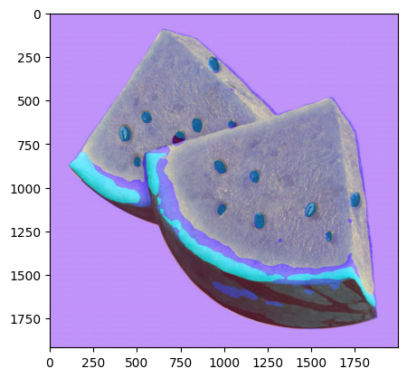

# MMSegmentation Train

```
06/16 08:23:02 - mmengine - INFO - per class results:
06/16 08:23:02 - mmengine - INFO - 
+--------------+-------+-------+
|    Class     |  IoU  |  Acc  |
+--------------+-------+-------+
| _background_ | 75.23 | 98.45 |
|     red      | 86.22 | 87.61 |
|    green     | 16.56 | 17.75 |
|    white     | 65.06 | 67.88 |
|  seed-black  | 63.66 | 78.23 |
|  seed-white  |  0.0  |  0.0  |
+--------------+-------+-------+
06/16 08:23:02 - mmengine - INFO - Iter(val) [17/17]    aAcc: 86.3900  mIoU: 51.1200  mAcc: 58.3200  data_time: 0.0052  time: 0.4238
06/16 08:24:00 - mmengine - INFO - Iter(train) [2900/3000]  lr: 9.3518e-03  eta: 0:00:57  time: 0.5780  data_time: 0.0083  memory: 3614  loss: 0.0365  decode.loss_ce: 0.0257  decode.acc_seg: 90.3107  aux.loss_ce: 0.0108  aux.acc_seg: 90.3900
06/16 08:24:58 - mmengine - INFO - Exp name: pspnet-watermelon_20230612_20230616_075443
06/16 08:24:58 - mmengine - INFO - Iter(train) [3000/3000]  lr: 9.3294e-03  eta: 0:00:00  time: 0.5769  data_time: 0.0080  memory: 3614  loss: 0.0331  decode.loss_ce: 0.0229  decode.acc_seg: 90.6036  aux.loss_ce: 0.0102  aux.acc_seg: 88.4277
06/16 08:24:58 - mmengine - INFO - Saving checkpoint at 3000 iterations
Completed train!
```


# MMSegmentation Test

```
06/16 08:49:36 - mmengine - INFO - Load checkpoint from work_dirs/watermelon/iter_3000.pth
06/16 08:50:25 - mmengine - INFO - per class results:
06/16 08:50:25 - mmengine - INFO - 
+--------------+-------+-------+
|    Class     |  IoU  |  Acc  |
+--------------+-------+-------+
| _background_ |  73.6 | 97.48 |
|     red      | 84.03 | 85.42 |
|    green     | 36.83 | 43.81 |
|    white     | 61.68 | 62.86 |
|  seed-black  | 62.33 | 67.38 |
|  seed-white  |  0.0  |  0.0  |
+--------------+-------+-------+
06/16 08:50:25 - mmengine - INFO - Iter(test) [17/17]    aAcc: 85.6000  mIoU: 53.0800  mAcc: 59.4900  data_time: 0.0151  time: 2.8580
```


# MMSegmentation Inference


## Image



## Video
https://github.com/jiongjiongli/OpenMMLabCamp/assets/33146359/fd1e0924-0fb7-4911-bfc5-caf7490f5124


# Code

[Jupyter Notebook](./notebooks/ homework4_mmseg_watermelon.ipynb)

